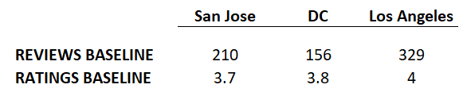
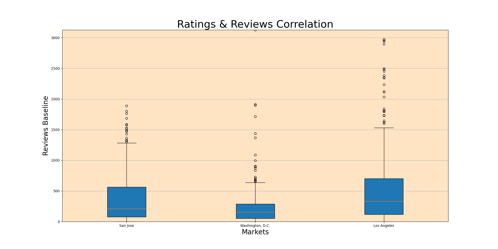
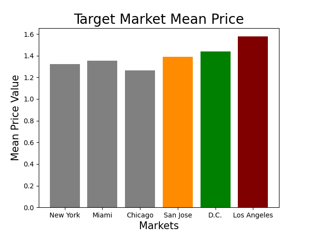
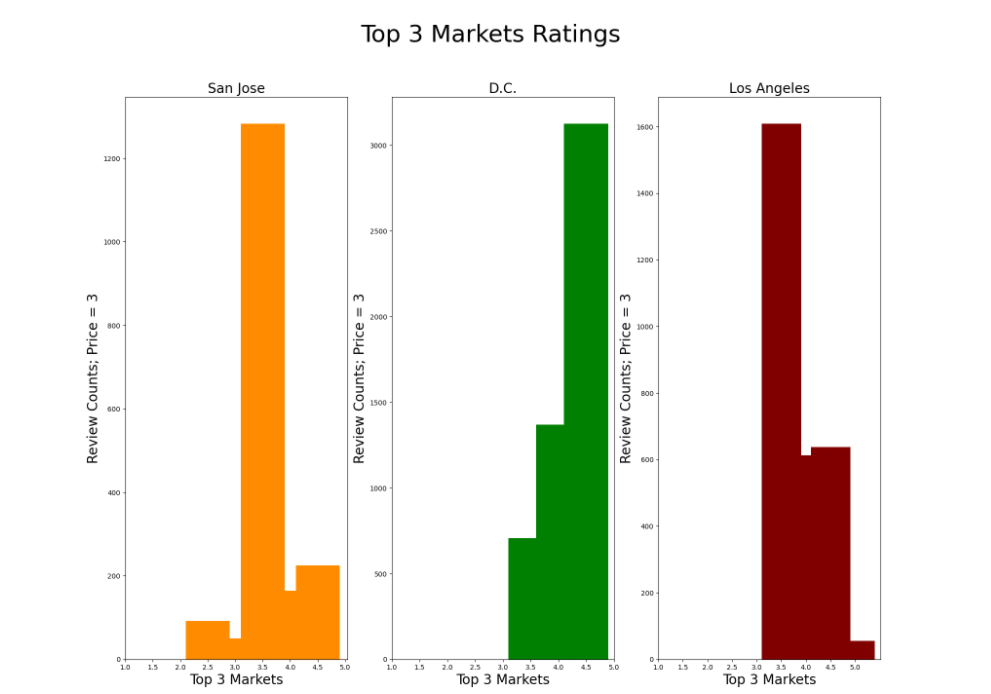

<br>
<br>

# Yelp Business Ideas Analysis

   **Author**: [Chaz](https://github.com/Mynusjanai), [Sunil](mailto:sean@flatironschool.com)
<br>
<br>
## Overview

This project analyzes the [Yelp open source data set] (https://www.yelp.com/developers/documentation/v3) to properly educate and propose a new business idea to an investor. Using data analysis and within our below presentation and findings, we believe opening a high-end Indian Restaurant in the Washington D.C. and Los Angeles, CA markets would be safe, stable and carries with it less risk. 
<br>
<br>

## Business Problem

An investor has approached us and wanted us to come up with a business idea that uses data analysis primarily against the Yelp open-source data set. They requested we come up with either a potential business in two potential markets or two potential businesses in a potential market. 

We determined that we will use data analysis on the Yelp data set to solve the problem. Our overlying assumptions made are that the sample set sizes have to be large enough (>100 businesses) for data analysis to be effective against the sample population and that the implementation, quality, and service of our proposed business idea be "as much, if not better than" existing businesses with the same profile. 
<br>
<br>

## Data


The Yelp platform, via their Application Program Interface (API), provides open-source access to certain business data, when given a category and location: business's name, location, category, price level (1-4), rating (0-5), and a number of reviews. The service also provides reviews per business, including the text and the time it was created. 

We used this platform, and internal python scripting, to extract the data.
<br>
<br>

## Methods

Due to the breadth of data and the openness of the potential solution, we implemented a bottoms-up approach in our analysis. We started with the entire potential data set and narrowed our results to individual solutions.  

We first decided to narrow down our search by identifying the top three categories which utilize the Yelp service, from both a business advertising perspective (advertising revenue) and consumer usage perspective. Based on that list, we identified a singular target market (high-end Indian Restaurant) based on the potential for effective application of data analysis on the data present. 

Next, we identified six target urban markets where we would potentially locate the business: Brooklyn, Miami, San Jose, Chicago, Washington D.C, and Los Angeles. We then used data analysis to determine which markets already had an existing higher concentration of high-end Indian restaurants in the area. 

Once narrowed down, we finally wanted to use data analytics to determine which remaining markets already have an appreciated consumer base of demand which would support a new entrant in the market with the business. In order to make comparisons, we first created "Baselines" of existing business "averages".
<br>
<br>



<br>
<br>
We then compared the Baseline results with the "averages" of existing high-end Indian restaurants in each market to determine the best markets in which to launch our business idea.
<br>
<br>



<br>
<br>

## Results

To first determine which markets have an existing, established base of higher-end Indian restaurants in their respective markets, we utilized the bar graph method to visualize which markets have the highest average "price levels" of higher-end restaurants (defined as higher "price level", a higher concentration of restaurants). We determined that San Jose, Washington D.C., and Los Angeles, CA all have a higher concentration of higher-end restaurants. 
<br>
<br>



<br>
<br>
We then created Baselines for the sample population of Indian Restaurants as averages for the "Number of Reviews per Restaurant"  and "Average Business Rating":
<br>
<br>



<br>
<br>
Comparing the Baselines to the "Averages" of existing Higher-End Indian restaurants in the area, we determined that Washington D.C. and Los Angeles are ideal markets to open a high-end Indian Restaurant, based on success probability and lower-risk profile. 
<br>
<br>


## Conclusions

This analysis leads to a solid business idea recommendation in specific markets:

- **Opening a high-end Indian Restaurant** Given the sample sizes of the respective available data, the restaurant category offers enough data (> 100 businesses) to make the analysis effective.
- **Open in the Washington D.C and Los Angeles, CA markets** There is a higher concentration of existing high-end Indian restaurants (defined as "price level of 3+") in these markets, signifying demand and less-risk, and the ratings and reviews are equal to, if not better than, the baseline for the average Indian restaurant in their respective markets, signifying consumer appreciation and less-risk/stability.
<br>
<br>


## Next Steps

Further analyses could yield additional insights to further improve our business process methods and our data analysis results:

- **Better prediction of business demand.** This modeling could use already available data, such as Census demographics data and Consumer Surveys, to better determine the demand for the particular offering.
- **Model need for business success indicators.** This modeling uses other business-financials-health relevant data to incorporate into our captured businesses to determine further correlations and better predictive outcomes.
<br>
<br>


## For More Information

See the full analysis in the [Jupyter Notebook](./analysis/yelp_business_analysis.ipynb) or review this [presentation](./analysis/yelp_project_presentation.pdf).

For additional info, contact [Chaz](https://github.com/Mynusjanai) or Sunil at [sean@flatironschool.com](mailto:sean@flatironschool.com)


```python

```

## Repository Structure

```
├── code
│   ├── all_code.ipynb
│   ├── data_acquisition_process.ipynb 
│   ├── __init__.py
├── data  
├── images
├── README.md
├── yelp_presentation.pdf
├── yelp_helper_func.py
├── final_project1_notebook.ipynb
```

